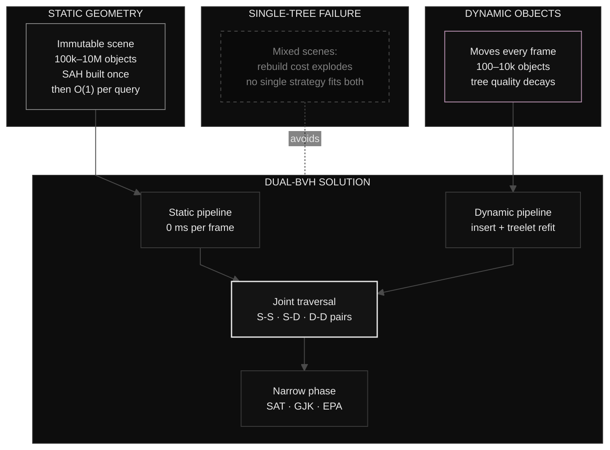

## Table of Contents

1. [Why Broad-Phase Exists (and why naive O(N²) dies at 10k objects)](#1-why-broad-phase-exists)
2. [Bounding Volume Hierarchy: The Data Structure That Scales](#2-bounding-volume-hierarchy-the-data-structure-that-scales)
3. [Topology Choices: Binary vs. Multi-Branch, Pointer vs. Array Layout](#3-topology-choices-binary-vs-multi-branch-pointer-vs-array-layout)
4. [Construction Algorithms: From Naive to SAH-Optimal](#4-construction-algorithms-from-naive-to-sah-optimal)
5. [Traversal Strategies for Collision Queries](#5-traversal-strategies-for-collision-queries)
6. [The Static/Dynamic Dichotomy: Why One Tree Cannot Serve Two Masters](#6-the-staticdynamic-dichotomy)
7. [The Dual-BVH Architecture Preview](#7-what-part-2-will-solve-the-dual-bvh-architecture-preview)

---

<a id="1-why-broad-phase-exists"></a>
## 1. Why Broad-Phase Exists
### The Pairwise Problem

Every collision detection system faces the same fundamental challenge: given *N* objects, determine which pairs *might* be colliding so the expensive narrow-phase (SAT, GJK, EPA) only runs on plausible candidates.

The naive approach tests every pair:

```cpp
// Naive O(N²) broad-phase — dies at ~10k objects
std::vector<CollisionPair> broadPhaseNaive(const std::vector<Object*>& objects) {
    std::vector<CollisionPair> pairs;
    for (size_t i = 0; i < objects.size(); ++i) {
        for (size_t j = i + 1; j < objects.size(); ++j) {
            if (aabbOverlap(objects[i]->aabb, objects[j]->aabb)) {
                pairs.emplace_back(objects[i], objects[j]);
            }
        }
    }
    return pairs;
}
```

**Complexity: $O(N²)$ AABB tests.** At 60 Hz you have 16.67 ms/frame. At 120 Hz: 8.33 ms. 

| Objects (N) | Pairwise Tests | @ 3 ns/test | Frame Budget (60 Hz) |
|-------------|----------------|-------------|----------------------|
| 100         | 4,950          | 0.015 ms    | Trivial              |
| 1,000       | 499,500        | 1.5 ms      | Comfortable          |
| 10,000      | 49,995,000     | 150 ms      | **10x over budget**  |
| 100,000     | ~5x10^9        | 15,000 ms   | Impossible           |

### Cache Miss Catastrophe

The pairwise loop doesn't just do too much work, it does it *poorly*. Each iteration accesses two random objects in memory. With 10k objects, you're thrashing L3 cache every frame. The BVH approach exploits spatial coherence: nearby objects in space are nearby in the tree, turning random access into sequential scans.

### The Real Job: Proving Separation

> **KEY INSIGHT: Broad-phase is a rejection machine.** Broad-phase is *not* about finding collisions. It's about *proving separation* as cheaply as possible. Every AABB overlap test that returns `false` is a victory, you've eliminated a narrow-phase call for zero cost. The BVH's job is to maximize these cheap rejections.

<iframe src="/comp/collision_pipeline.html" width="100%" height="600" style="border:none;"></iframe>


<a id="2-bounding-volume-hierarchy-the-data-structure-that-scales"></a>
## 2. Bounding Volume Hierarchy: The Data Structure That Scales
### Formal Definition

A **Bounding Volume Hierarchy (BVH)** is a tree where:
- **Leaf nodes** store an object's AABB (and object ID)
- **Internal nodes** store the union AABB of their children
- **Invariant:** Parent AABB fully contains all descendant AABBs (no gaps)

### BVH Tree Structure

<table style="border-collapse: collapse; border: none; width: auto;">
  <tr>
    <td align="center" style="padding: 0 10px 0 10px; vertical-align: top;">
      
      <em style="display: block; margin-top: -20px; font-style: italic;">physics collider</em>
    </td>
    <td align="center" style="padding: 0 10px 0 10px; vertical-align: top;">
      
      <em style="display: block; margin-top: -20px; font-style: italic;"> BVH tree</em>
    </td>
  </tr>
</table>

<div align="center" style="margin-top: -20px;">
<iframe src="/comp/bvh_tree.html" width="100%" height="560" style="border:none;"></iframe> 
</div>

> **Invariant:** the parent AABB contains *all* descendants. A query traverses two trees simultaneously and early-outs the moment an AABB-overlap test on a node pair fails.

### Collision Detection Query: The Key Difference from Ray Tracing

Ray tracing traverses **one BVH** with a **ray**, stopping at the closest hit. Collision detection traverses **two BVHs simultaneously** (or one BVH vs. query volume), collecting **all overlapping pairs**. No early termination on "closest" we need the complete set.

```cpp
void traverseBVHvsBVH(const BVHNode* a, const BVHNode* b, 
                      std::vector<CollisionPair>& out) {
    if (!aabbOverlap(a->bounds, b->bounds)) return;  // Proved separation
    
    if (a->isLeaf && b->isLeaf) {
        out.emplace_back(a->objectId, b->objectId);
        return;
    }
    
    // Recurse into children 
    if (a->isLeaf || (!b->isLeaf && b->depth > a->depth)) {
        traverseBVHvsBVH(a, b->left, out);
        traverseBVHvsBVH(a, b->right, out);
    } else {
        traverseBVHvsBVH(a->left, b, out);
        traverseBVHvsBVH(a->right, b, out);
    }
}
```

### Memory Layout: Cache-Friendly First

| Layout | Pros | Cons | Best For |
|--------|------|------|----------|
| **Pointer-based** (`Node* left, right`) | Flexible, easy dynamic modification | Cache misses, allocation overhead | Prototyping |
| **Array-based / SoA** (separate arrays for min/max/children) | Maximum SIMD, perfect prefetch | Fixed topology, complex refit | Static trees, GPU |
| **Hybrid: Array of structs with indices** | Cache-friendly, supports rebuild, SIMD-ready | Slightly larger nodes | **Production CPU** |

---

<a id="3-topology-choices-binary-vs-multi-branch-pointer-vs-array-layout"></a>
## 3. Topology Choices: Binary vs. Multi-Branch
### Branching Factor Trade-offs

| Factor | BVH2 (Binary) | BVH4 | BVH8 |
|--------|---------------|------|------|
| **Tree depth** | log₂(N) | log₄(N) | log₈(N) |
| **SIMD width** | 2-wide (SSE) | 4-wide (AVX2) | 8-wide (AVX-512) |
| **Internal node size** | 32 bytes | 64 bytes | 128 bytes |
| **False positive rate** | Lowest | Medium | Highest |
| **Leaf pairs tested** | Fewest | More | Most |
| **Construction complexity** | Simple | Moderate | Complex |

### Collision-Specific Insight

For ray tracing: **traversal depth** dominates (early termination on closest hit). Wider = better.

For collision detection: **leaf pair count** dominates (no early termination, need all overlaps). Wider BVH = larger internal AABBs = more false positives = more narrow-phase calls.

```
Expected node visits ≈ (branching_factor)^depth × false_positive_rate
                     ≈ N^(1/log₂(branching_factor)) × (1 + ε×branching_factor)
```

**Recommendation:** BVH2 or BVH4 for CPU collision. BVH8+ only for GPU ray tracing where traversal depth matters more than pair count.

---

<a id="4-construction-algorithms-from-naive-to-sah-optimal"></a>
## 4. Construction Algorithms: From Naive to SAH-Optimal

Building a Bounding Volume Hierarchy (BVH) is a balancing act between build speed and tree quality. A high-quality tree renders frames much faster, but takes longer to construct.

### 4.1 Naive Top-Down (Median Split)

The simplest way to build a BVH is to divide and conquer using the median split method:
- Find the longest axis of the current bounding box (X, Y, or Z).
- Sort all objects along this axis based on their center points.
- Split the list exactly in half, putting 50% of the objects in the left child and 50% in the right child.
- Recurse until you hit a leaf node.

**Complexity:** $O(N log N)$.

**Flaw:** Splits by object *count*, not surface area. Clusters produce terrible trees.

```cpp
BVHNode* buildMedian(std::vector<Object*>& objects, int start, int end) {
    if (end - start == 1) return createLeaf(objects[start]);
    
    // Find longest axis
    AABB bounds = computeBounds(objects, start, end);
    int axis = longestAxis(bounds);
    
    // Sort by centroid on that axis
    std::sort(objects.begin() + start, objects.begin() + end,
        [axis](Object* a, Object* b) {
            return a->aabb.centroid()[axis] < b->aabb.centroid()[axis];
        });
    
    int mid = start + (end - start) / 2;
    BVHNode* left  = buildMedian(objects, start, mid);
    BVHNode* right = buildMedian(objects, mid, end);
    return createInternal(left, right);
}
```

### 4.2 Surface Area Heuristic (SAH) - The Gold Standard

Instead of just checking the median, the SAH algorithm sweeps across the axis, evaluating the cost equation at different intervals or at every single object boundary. It then picks the exact split plane that yields the lowest mathematical cost.

**Cost model:** Expected cost of traversing a node:

$$C = C_{trav} + \frac{SA(L)}{SA(P)} N_L C_{isct} + \frac{SA(R)}{SA(P)} N_R C_{isct}$$

Where:
-  $C_{trav}$ : Cost of traversing a node.
- $C_{isct}$: Cost of intersecting a primitive.
- $SA(P), SA(L), SA(R)$: Surface area of the Parent, Left child, and Right child.
- $N_L, N_R$: Number of primitives in the left and right children.


**Complexity:** $O(N log² N)$ with spatial sorting, $O(N² log N)$ naive. Optimal quality.

**Verdict:** Slow to build, but produces structurally optimal trees. It is the gold standard for static scene geometry.

### Full SAH Build Algorith
```cpp
BVHNode* buildSAH(std::vector<Object*>& objects, int start, int end) {
    if (end - start == 1) return createLeaf(objects[start]);
    
    AABB totalBounds = computeBounds(objects, start, end);
    int bestAxis = -1;
    int bestSplit = -1;
    float bestCost = INFINITY;
    
    // Try all 3 axes
    for (int axis = 0; axis < 3; ++axis) {
        // Sort by centroid on this axis
        std::sort(objects.begin() + start, objects.begin() + end,
            [axis](Object* a, Object* b) {
                return a->aabb.centroid()[axis] < b->aabb.centroid()[axis];
            });
        
        // Evaluate EVERY split position (not just bins)
        AABB leftBounds, rightBounds = totalBounds;
        for (int i = start + 1; i < end; ++i) {
            leftBounds.expand(objects[i-1]->aabb);
            rightBounds = computeBounds(objects, i, end);
            
            float pLeft  = leftBounds.surfaceArea()  / totalBounds.surfaceArea();
            float pRight = rightBounds.surfaceArea() / totalBounds.surfaceArea();
            float cost = C_TRAV + pLeft * (i - start) * C_ISCT + pRight * (end - i) * C_ISCT;
            
            if (cost < bestCost) {
                bestCost = cost; bestAxis = axis; bestSplit = i;
            }
        }
    }
    
    // Partition at best split, recurse
    std::nth_element(objects.begin() + start, objects.begin() + bestSplit, objects.begin() + end,
        [bestAxis](Object* a, Object* b) {
            return a->aabb.centroid()[bestAxis] < b->aabb.centroid()[bestAxis];
        });
    
    return createInternal(
        buildSAH(objects, start, bestSplit),
        buildSAH(objects, bestSplit, end)
    );
}
```


### 4.3 Linear BVH (LBVH) / Morton Codes 

LBVH builds the tree from the bottom up in linear time using a clever spatial hashing trick: Morton Codes. By taking the binary bits of an object's 3D coordinates (X, Y, Z) and interleaving them, we map 3D space into a 1D integer.

**Complexity:** $O(N)$

**Trade-off:** 30-50% worse SAH cost vs. full SAH, but 10-100× faster build. Good for dynamic rebuilds; poor for static tree quality.

> Watch this for a detailed explanation.
><div style="width: 100%; max-width: 700px; margin: 0 auto;">
  <iframe 
    style="width: 100%; height: auto; aspect-ratio: 700 / 400;"
    src="https://youtube.be/embed/LAxHQZ8RjQ4" 
    title="24 - Bounding Volume Hierarchies with a blazing fast implementation using Morton codes" 
    frameborder="0" 
    allow="accelerometer; autoplay; clipboard-write; encrypted-media; gyroscope; picture-in-picture; web-share" 
    referrerpolicy="strict-origin-when-cross-origin" 
    allowfullscreen>
  </iframe>
</div>

### 4.4 HLBVH (Hierarchical LBVH)

HLBVH offers the best of both worlds. It uses the ultra-fast LBVH Morton code method to group small clusters of objects at the bottom of the tree, and then uses the high-quality SAH method to build the top levels of the tree. This results in near-optimal speeds with incredibly fast build times.

LBVH for large clusters + SAH for small clusters. Best of both: near-SAH quality, near-LBVH speed.

### 4.5 Parallel Construction
Task graph: partition objects → build subtree per task → merge. **Ideal: $O(N log N / P)$**, synchronization overhead real.

| Algorithm          | Build Time    | Tree Quality (SAH) | Parallelizability     |
| ------------------ | ------------- | ------------------ | --------------------- |
| Median Split       | Fast          | Poor               | Easy                  |
| Full SAH (optimal) | Slow          | **Optimal**        | Moderate              |
| LBVH               | Very Fast     | 30-50% worse       | Trivial (radix sort)  |
| HLBVH              | Fast          | Near-optimal       | Good                  |
| Parallel SAH       | Fast (scales) | Optimal            | Good (TBB/job system) |

---

<a id="5-traversal-strategies-for-collision-queries"></a>
## 5. Traversal Strategies for Collision Queries
The three traversal families below solve different query shapes. Their trade-offs are summarized first, then detailed in code.

| Strategy | Use Case | Memory | Collision? |
|----------|----------|--------|------------|
| **Iterative Pair** (BVH vs BVH) | Two-world / self-collision | Stack | Yes (all pairs) |
| **Stackless** (BVH vs AABB) | Raycast, frustum, sweep | Zero stack | Single tree |
| **SIMD BVH4** (BVH vs AABB) | High-throughput queries | SoA layout | Single tree |
| **Front-to-Back** | Ray tracing | Priority queue | No (wrong model) |
| **Depth-First** | Collision | Stack | Yes (all pairs) |


### 5.1 BVH vs. BVH (Two-World / Self-Collision)

Simultaneous traversal of two trees. Stack of node pairs. Early-out on AABB overlap test.

```cpp
void traverseBVHvsBVHIterative(const BVH& a, const BVH& b, 
                                std::vector<CollisionPair>& out) {
    struct StackEntry { uint32_t nodeA, nodeB; };
    std::vector<StackEntry> stack;
    stack.reserve(256);
    stack.push_back({0, 0});  // Root indices
    
    while (!stack.empty()) {
        auto [ia, ib] = stack.back(); stack.pop_back();
        const BVHNode& na = a.nodes[ia];
        const BVHNode& nb = b.nodes[ib];
        
        if (!aabbOverlap(na.bounds, nb.bounds)) continue;
        
        if (na.isLeaf && nb.isLeaf) {
            out.emplace_back(na.objectId, nb.objectId);
        } else if (na.isLeaf) {
            stack.push_back({ia, nb.left});
            stack.push_back({ia, nb.right});
        } else if (nb.isLeaf) {
            stack.push_back({na.left, ib});
            stack.push_back({na.right, ib});
        } else {
            // Both internal 
            // push all 4 combinations
            stack.push_back({na.left,  nb.left});
            stack.push_back({na.left,  nb.right});
            stack.push_back({na.right, nb.left});
            stack.push_back({na.right, nb.right});
        }
    }
}
```

### 5.2 BVH vs. Query Volume (Raycast / Sweep / Frustum)

Single-tree traversal with query volume. **Key difference from ray tracing:** no "closest hit" termination we need *all* overlaps.

### 5.3 Stackless Traversal (Pointerless / Index-Based)

Parent index stored in node → no explicit stack needed.

```cpp
void traverseStackless(const BVH& bvh, const AABB& query, 
                       std::vector<uint32_t>& out) {
    uint32_t node = 0;  // Start at root
    uint32_t prev = UINT32_MAX;
    
    while (node != UINT32_MAX) {
        const BVHNode& n = bvh.nodes[node];
        
        // Coming down from parent
        if (prev == (node == 0 ? UINT32_MAX : bvh.nodes[node].parent)) {
            if (!aabbOverlap(n.bounds, query)) {
                // go to sibling or up
                node = (n.isLeaf || n.right == UINT32_MAX) ? n.parent : n.right;
            } else if (n.isLeaf) {
                out.push_back(n.objectId);
                node = (n.right == UINT32_MAX) ? n.parent : n.right;
            } else {
                node = n.left;  
            }
        }
        // Coming up from left child
        else if (prev == n.left) {
            node = (n.right == UINT32_MAX) ? n.parent : n.right;
        }
        // Coming up from right child
        else {
            node = n.parent;
        }
        prev = (node == UINT32_MAX) ? UINT32_MAX : node;
    }
}
```

**Trade-off:** More instructions per node, but zero stack allocation, cache-friendly.

### 5.4 Front-to-Back vs. Depth-First Ordering

| Ordering | Ray Tracing | Collision Detection |
|----------|-------------|---------------------|
| Front-to-back | Enables early termination | No benefit (need all pairs) |
| Depth-first | Misses early termination | Cache-friendly, simple |
| Breadth-first | High memory | High memory |

**Insight:** Collision BVH traversal is *simpler* than ray tracing (no closest-hit logic) but does *more work* (must visit all overlapping nodes).

---

<a id="6-the-staticdynamic-dichotomy"></a>
## 6. The Static/Dynamic Dichotomy



### 6.1 Static Geometry Characteristics

- World mesh, level geometry, baked props
- **Immutable at runtime** 
- **Massive count:** 100k-10M triangles/objects
- **Quality requirement:** Optimal SAH (built once, queried millions of times)
- **Build cost amortization:** O(N log N) once → O(1) per frame forever

### 6.2 Dynamic Objects Characteristics

- Characters, vehicles, debris, projectiles
- **Transform every frame** (translation + rotation)
- **Moderate count:** 100-10k objects
- **Quality degradation:** Insertion inflates AABBs → tree quality decays
- **Rebuild frequency:** Every frame (costly) vs. incremental (degrading)

### 6.3 The Single-Tree Failure Modes

| Scenario | Single Tree Result |
|----------|-------------------|
| Static-heavy (1M static, 1k dynamic) | Rebuilding 1M nodes/frame = impossible |
| Dynamic-heavy (10k dynamic, 1k static) | Static objects pollute dynamic tree quality |
| Mixed | No optimal strategy exists |

### 6.4 Quantitative Case Study

- **100k static triangles + 5k dynamic objects**
- Single tree rebuild: ~50 ms/frame (unacceptable)
- Dual tree: Static 0 ms/frame, Dynamic 0.5 ms/frame (with incremental updates)

---

<a id="7-what-part-2-will-solve-the-dual-bvh-architecture-preview"></a>
## 7. The Dual-BVH Architecture Preview

### The Problem Statement

We need:
- **Static tree:** Optimal SAH build, zero runtime cost, queried millions of times
- **Dynamic tree:** Incremental updates, bounded quality degradation
- **Safe concurrent reconstruction:** Readers never block, writers never wait

### Three Innovations Previewed

1. **Dual-BVH separation**: Static and dynamic pipelines completely independent
2. **Amortized treelet reconstruction** : O(1) frame cost via bounded *k* treelets rebuilt per frame
3. **epoch system **: Read and write separation. 

### What Part 2 Will Cover

Full system mechanics: static tree construction pipeline, dynamic tree greedy insertion with degradation tracking, treelet rebuild ,Intrusive linked lists, epoch system, frame pipeline integration.

---
## Resources & Further Learning

### Video Tutorials

- **Building Collision Simulations - Reducible**    
    [Watch on YouTube →](https://www.youtube.com/watch?v=eED4bSkYCB8)
- **Coding Adventure: Optimizing a Ray Tracer by Building a BVH - Sebastian Lague**  
	[Watch on YouTube →](https://www.youtube.com/watch?v=C1H4zIiCOaI)
### Articles & Documentation

- **Bounding Volume Hierarchies - University of Illinois**   
	[Read the article →](https://cs418.cs.illinois.edu/website/text/bvh.html)

- **Real-Time Collision Detection - Christer Ericson**   
    [Read Chapter 6 →](https://www.oreilly.com/library/view/real-time-collision-detection/9781558607323/xhtml/c06.xhtml)

___
